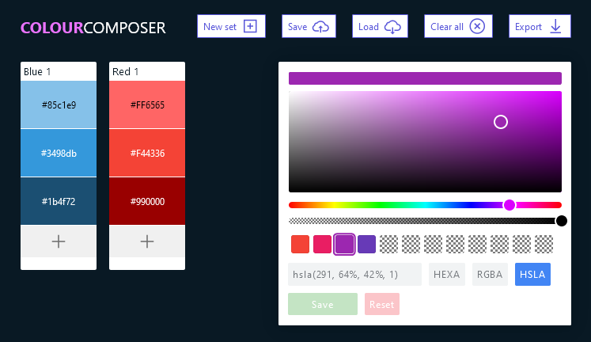

# Colour Composer

Simple and user friendly utility for composing colour palettes created with Vue 3. No server or compilation required, it just runs.

*This is a preview edition.*

### Known issues

* Not touchscreen/tablet/mobile friendly
* Accessibility issues

### Further development

* Reorder colours
* Edit colour picker swatches
* Copy colour to clipboard
* Multiple save slots
* Export colours as JSON
* Download colours as JSON file
* Import JSON file
* Missing animations

## Credits

### Pickr

Author: Simon Reinisch [trash@reinisch.io](mailto:trash@reinisch.io)
URL: [https://github.com/Simonwep/pickr](https://github.com/Simonwep/pickr)
License: MIT

### LineAwesome

Author: Icons8 LLC.
URL: [https://icons8.com/line-awesome](https://icons8.com/line-awesome)
License: MIT

## License

Created by Bjornar Egede-Nissen, 2022.

Licenced under the MIT licence ([terms](./LICENSE)).